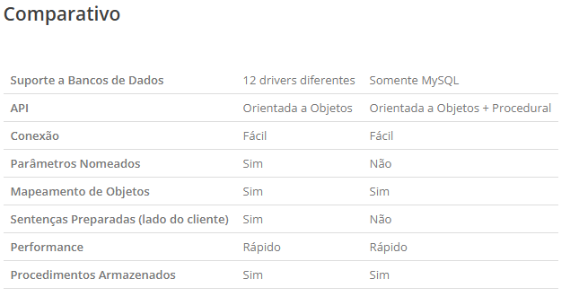

# Pesquisa – PDO

## O que é o PDO; 
PDO(PHP Data Objects) é um módulo de PHP montado sob o paradigma Orientado a Objetos, cujo objetivo é prover uma padronização da forma com que PHP se comunica com um banco de dados relacional.
Este módulo surgiu a partir da versão 5 de PHP. PDO, portanto, é uma interface que define um conjunto de classes e a assinatura dos métodos de comunicação com uma base de dados.

## Para que ele é utilizado no PHP; 
O PDO (PHP Data Object) é uma extensão da linguagem PHP para acesso a banco de dados. 

## Como funciona uma conexão utilizando PDO;
O PDO (PHP Data Objects) define uma interface de conexão a banco de dados leve e consistente para PHP. Há a possibilidade de utilização de diversos drivers de conexão que implementam a interface do PDO para vários tipos de bancos de dados.

Como o PDO representa uma camada de abstração de acesso aos dados, as mesmas funções utilizadas para manipular dados ou recuperar informações do banco serão as mesmas, independentemente do banco de dados que esteja sendo usado.

## Quais são suas principais características; 
Totalmente orientado a objetos, ele possui diversos recursos importantes, além de suporte a diversos mecanismos de banco de dados. 
1. Queries parametrizadas;
2. Diferentes tipos de retorno;
3. Diferentes tipos de tratamento de exceções;
4. Tratamento de transações;

## Diferenças entre PDO e MySQLi;
A PHP já anunciou o descontinuamento da extensão original do MySQL, nomeando-a como obsoleta e já com planos para desligá-la completamente em versões futuras. A partir da versão PHP 5.5, tentativas de conexão e execução de querys com a antiga ferramenta irá gerar mensagens de alerta, denunciando que o método está obsoleto. A antiga forma de conexão com o MySQL  já está a caminho de deixar de existir.
Querendo ou não, o desligamento da antiga ferramenta MySQL é inevitável. Sem dúvida, o trabalho para conseguir migrar todas as funções de conexão com o MySQL para uma outra ferramenta, em provavelmente grande parte de seus projetos, vai ser custosa e demorada. Porém, é muito provável que seus esforços serão recompensados. Em seu site, a PHP nos indica duas ferramentas de conexão com o MySQL: a MySQLi (Improved) e o PDO.

Tanto PDO quanto MySQli oferecem um API orientada a objetos, mas o MySQLi também oferece uma API procedural – facilitando o entendimento por parte dos novatos. Se você já é familiarizado com o driver nativo do MySQL para PHP, migrar para a interface procedural do MySQLi será extremamente simples. Por outro lado, uma vez que você compreender a PDO, você poderá usá-la com qualquer banco de dados que desejar.
A principal vantagem do PDO sobre o MySQLi é seu suporte aos drivers de diversos bancos de dados. No momento em que traduzimos esse artigo, o PDO dá suporte a 12 tipos diferentes de drivers, enquanto o MySQLi só dá suporte ao MySQL.
Em situações que você precisar usar outro banco de dados, a PDO torna esse processo transparente. Então, a única coisa que você precisará fazer é mudar os parâmetros de conexão e algumas consultas, isso se elas usarem algum método que não seja suportado por outra base de dados. Já com o MySQLi, você precisará reescrever todo o código que lida com banco de dados,  inclusive as consultas.
Conclusão: O PDO possuí suporte a 12 drivers de bases de dados diferentes e parâmetros nomeados. MySQLi ganha em desempenho, comparado com o PDO  e possui uma sintaxe mais simples, facilitando a migração a partir do antigo MySQL. Com relação à segurança, ambas são seguras, desde que o desenvolvedor saiba usá-las da forma correta.
Caso esteja procurando desempenho em suas querys e não queira esquentar a cabeça para aprender uma nova ferramenta de conexão com o banco de dados, talvez o MySQLi seja sua melhor escolha. Caso esteja procurando uma ferramenta mais completa e robusta, o PDO MySQL seria a melhor escolha.

## Vantagens e desvantagens de utilizar PDO; 
### Vantagens:
- Funciona com 12 drivers de bancos de dados diferentes (4D, MS SQL Server, Firebird/Interbase, MySQL, Oracle, ODBC/DB2, PostgreSQL, SQLite, Informix, IBM, CUBRID);
- API Orientada a objetos;
- Possui parâmetros nomeados;
- Possui prepared statements do lado cliente (ver desvantagens abaixo)
### Desvantagens:
- Não tão veloz quanto MySQLi;
- Por padrão, ele simula prepared statements (você pode ativar a versão nativa ao configurar a conexão dele com o banco, mas caso a versão nativa não funcione por algum motivo, ele volta a simular os prepared statements sem disparar erros ou avisos).

## O que são Prepared Statements e por que são importantes;
É um método de proteção a mais, além de um recurso do banco de dados usando comandos SQL, separando SQL dos dados.

## Em quais situações o PDO pode ser uma boa escolha.
O PDO (PHP Data Objects) pode ser uma boa escolha quando se busca portabilidade com o banco de dados, segurança nativa e padronização no desenvolvimento PHP. Ele funciona como uma camada de abstração, permitindo que você use o mesmo código para se conectar a diferentes sistemas de banco de dados, se tornando uma boa escolha quando o projeto pode mudar de banco de dados, como de MySQL, para PostgreSQL, SQLite, Oracle ou SQL Server. O PDO também pode ser útil quando se lida com dados inseridos por usuários, pois ele tem suporte nativo para Prepared Statements. 

## Fontes: 
- https://www.treinaweb.com.br/blog/o-que-e-pdo-no-php
- https://www.locaweb.com.br/ajuda/wiki/tudo-sobre-o-php-data-object-pdo-hospedagem-de-sites/
- https://pt.stackoverflow.com/questions/8302/mysqli-vs-pdo-qual-o-mais-recomendado-para-usar
- https://www.devmedia.com.br/php-pdo-como-se-conectar-ao-banco-de-dados/37211
- https://www.php.net/manual/pt_BR/book.pdo.php
- https://www.turbosite.com.br/blog/pdo-ou-mysqli-qual-usar
